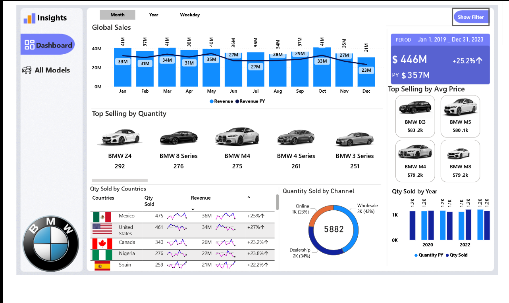
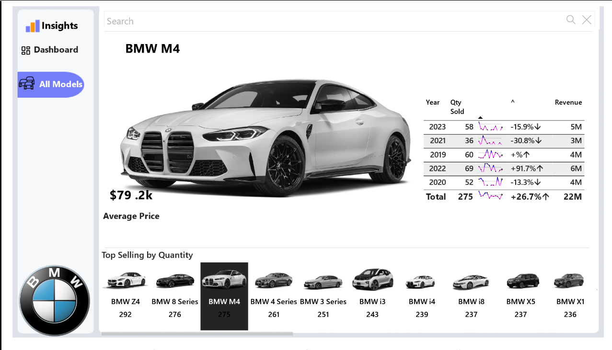

# BMW-Sales-Analysis
# BMW-Car-Sales
---
# 🚘 BMW Sales Dashboard
**An interactive business intelligence dashboard designed to analyze BMW car sales across multiple dimensions, providing insights into revenue trends, product performance, and regional sales behavior. Built to empower data-driven decisions for sales optimization and market strategy.**
---
# 📊 Features
**The dashboard includes a comprehensive set of visual insights:**

* Revenue Metrics

* Current year revenue

* Previous year revenue

* Year-over-year revenue growth

* Sales Quantity & Growth

* Units sold across years

* Annual growth in quantity sold

* Geographical Breakdown

* Quantity sold by country

* Revenue by country

* Sales volume by region

* Channel Insights

* Quantity sold by sales channel

* Revenue distribution across channels

* Time Analysis

* Sales performance by year, month, and week name

* Seasonality trends and time-based comparisons
  
**Product Drilldown**

* BMW model-specific sales data

* Top-performing and underperforming models

* Interactivity & Filters

* Dynamic slicers to filter by region, year, country, model, channel, and more

* Responsive visuals and tooltips for deeper exploration
---
# 📈 Metrics-Based Analysis
This section highlights analysis insights directly derived from dashboard metrics:

* Revenue growth in **Mexico** surged by 25%, largely due to strong performance in Q2.

* Model **BMW Z4** outperformed others across all sales channels, contributing to **5.1%** of total revenue in the current fiscal year.

* **Wholesales** sales channels saw a **43%** increase in unit sales compared to  Dealership and Online, signaling a shift in buyer behavior.

* **North America** consistent month-over-month growth suggests a ripe opportunity for whole sale and dealership expansion and regional promotions.

* **North America** has the most revenue generated by region with about **$96M**  closely followed by **Africa** region with about **$91M** revenue generated, **South America** has the least revenue generated about **$83M** .

* the **BMW Z4** was the most model sold with about **292** cars was sold followed by **BMW M4** that about **275** of the cars was sold, **BMW X4** was the least sold cars with **182** sales made.

* **Mexico** generated the most revenue with about **$36M** revenue was generated closely followed by
 **United States** which generated **$34M** in revenue, the lowest country in revenue is **Italy** which generated about **$16M** in revenue.

---
# 🛠️ Tech Stack
Power BI Desktop

Power Query for data transformation

DAX for custom metrics and KPIs

Visuals: bar charts, line graphs, pie charts, cards, slicers

---
# 🔍 Business Recommendations
* Expand Operations in Mexico Leverage the 25% revenue growth and strong Q2 performance by increasing inventory allocation, dealership support, and localized marketing in the Mexican market.

* Double Down on BMW Z4 & M4 Promotions With the BMW Z4 and M4 leading unit sales and contributing significantly to revenue, consider bundling premium services or introducing limited-edition  models to maintain momentum and brand desirability.

* Prioritize Wholesale Channels The 43% surge in wholesale volume suggests a behavioral shift; expand partnerships and streamline B2B logistics to capitalize on this growth trajectory.

* Invest in North American Regional Strategy North America, generating $96M, consistently outperforms in revenue and growth. Launch targeted dealership expansion and regional promotions to maintain market leadership.

* Reevaluate Performance in South America and Italy With South America and Italy showing the lowest revenue, conduct market research to uncover barriers (e.g., pricing, product fit, supply challenges) and restructure efforts accordingly.

* Data-Driven Inventory Planning Use country-level and model-level demand insights to optimize stock allocation, reducing underperforming model surplus (e.g., BMW X4) and improving supply for high-demand units.

* Channel-Specific Marketing Campaigns With wholesales outperforming other channels by 43%, design channel-specific promotions and loyalty programs tailored to B2B buyers and bulk resellers to maximize momentum.

* Model Rationalization Strategy Given the lower performance of the BMW X4 (only 182 units sold), conduct a margin analysis to determine if it's best to phase out the model in select markets or reposition it with added features or pricing adjustments.

* Incentivize Mid-Tier Models With BMW Z4 and M4 dominating, introduce incentives or bundles for mid-performing models to prevent overconcentration and diversify the sales portfolio.
